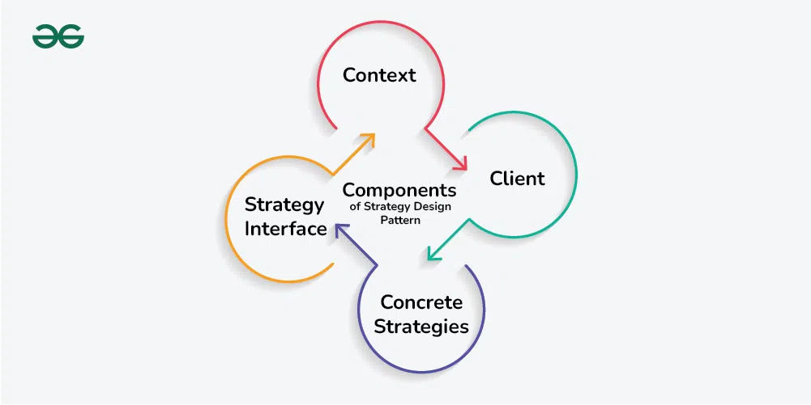
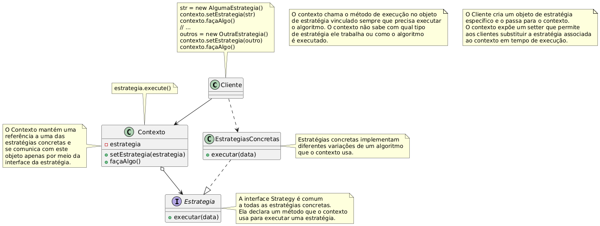

# Design Pattern - Strategy
Repositório para a atividade avaliativa sobre o padrão de projeto - Strategy | Engenharia de Software - 2025

---

# Padrão Comportamental
Categoria de padrões de design que se concentra nas interações e na comunicação entre objetos. Eles ajudam a definir como os objetos colaboram e distribuem responsabilidades entre si, facilitando o gerenciamento de fluxos de controle complexos e a comunicação em um sistema [GEEK](https://www.geeksforgeeks.org/system-design/behavioral-design-patterns/).

# Strategy
Strategy é um padrão de design comportamental que permite definir a família dos algoritmos, pondo cada um em classes separadas, tornando seus objetos intercambiáveis [GURU](https://refactoring.guru/design-patterns/strategy). Permite que os clientes troquem algoritmos dinamicamente sem alterar a estrutura do código, útil quando deseja alterar dinamicamente o comportamento de uma classe sem modificar seu código [GEEK](https://www.geeksforgeeks.org/system-design/strategy-pattern-set-1/).

Imagem: Componentes do Strategy

 Fonte: 
 <a href="https://www.geeksforgeeks.org/system-design/strategy-pattern-set-1/">Geek for Geeks (2025)</a>

## Características
* Define uma família de algoritmos: O padrão permite encapsular vários algoritmos ou comportamentos em classes separadas, conhecidas como estratégias.
* Encapsula comportamentos: cada estratégia encapsula um comportamento ou algoritmo específico, fornecendo uma maneira limpa e modular de gerenciar diferentes variações ou implementações.
* Permite a troca dinâmica de comportamento: o padrão permite que os clientes alternem entre diferentes estratégias em tempo de execução, permitindo mudanças de comportamento flexíveis e dinâmicas.
* Promove a colaboração de objetos: o padrão incentiva a colaboração entre um objeto de contexto e objetos de estratégia, onde o contexto delega a execução de um comportamento a um objeto de estratégia.

## Aplicação
* Use o padrão Strategy quando você quiser usar diferentes variantes de um algoritmo dentro de um objeto e poder alternar de um para outro em tempo de execução.
  * O padrão Strategy permite alterar indiretamente o comportamento do objeto em tempo de execução associando-o a diferentes sub-objetos que podem executar sub tarefas específicas de diferentes formas.
* Use o Strategy quando você tem várias classes similares que diferem apenas na forma como executam algum comportamento.
  * O padrão Strategy permite extrair o comportamento variável para uma hierarquia separada de classes, combinando as classes originais em uma só, reduzindo assim código duplicado.
* Use o padrão para isolar a lógica de negócio de uma classe dos detalhes de implementação de algoritmos que podem não ser tão importantes no contexto daquela lógica.
  * O padrão Strategy isola o código, dados internos e dependências de vários algoritmos do restante do código. Vários clientes recebem uma interface simples para executar os algoritmos e alterná-los em tempo de execução.
* Use o padrão quando sua classe tem um enorme bloco condicional que escolhe entre diferentes variantes do mesmo algoritmo.
  * O padrão Strategy elimina esse condicional ao extrair todos os algoritmos para classes separadas, todas implementando a mesma interface. O objeto original delega a execução para um desses objetos, ao invés de implementar todas as variantes do algoritmo.
 

Imagem: Diagrama - traduzido

 Fonte: 
 <a href="https://refactoring.guru/design-patterns/strategy">Guru (2025)</a>

## Implementação
1. Na classe context, identifique um algoritmo que costuma mudar com frequência. Pode ser um grande condicional que seleciona e executa uma variante do mesmo algoritmo em tempo de execução.
2. Declare uma interface strategy comum a todas as variantes do algoritmo.
3. Extraia, uma a uma, todas as variantes do algoritmo para suas próprias classes. Elas devem implementar a interface strategy.
4. Na classe context, adicione um campo para armazenar a referência ao objeto strategy. Forneça um método para substituir essa referência. O context deve trabalhar com o objeto strategy apenas via interface strategy. O contexto pode definir uma interface para permitir que strategy acesse seus dados.
5. Os clientes do contexto devem associá-lo a uma strategy adequada que corresponda à forma como esperam que ele execute seu trabalho principal.
  
## Prós e Contras
### Vantagens:
● Você pode trocar os algoritmos usados dentro de um objeto em tempo de execução.
● Pode isolar os detalhes de implementação de um algoritmo do código que o usa.
● Pode substituir herança por composição.
● Princípio Aberto/Fechado: você pode introduzir novas estratégias sem alterar o contexto.
### Desvantagens:
● Se você tem só alguns algoritmos e eles raramente mudam, não há razão para complicar o programa com novas classes e interfaces do padrão.
● Os clientes precisam conhecer as diferenças entre as estratégias para escolher a correta.
● Muitas linguagens modernas suportam funções anônimas, o que permite implementar variantes de um algoritmo como funções, usando-as como estratégias, sem precisar adicionar muitas classes e interfaces.

# Referências
https://refactoring.guru/design-patterns/strategy
https://www.geeksforgeeks.org/system-design/strategy-pattern-set-1/
https://www.geeksforgeeks.org/system-design/behavioral-design-patterns/

## Instituição

**Instituto Federal do Paraná - IFPR - Campus [Cascavel](https://ifpr.edu.br/cascavel/)**  
Curso: Tecnologia em Análise e Desenvolvimento de Sistemas.

---

> Documento elaborado com [StackEdit](https://stackedit.io).
